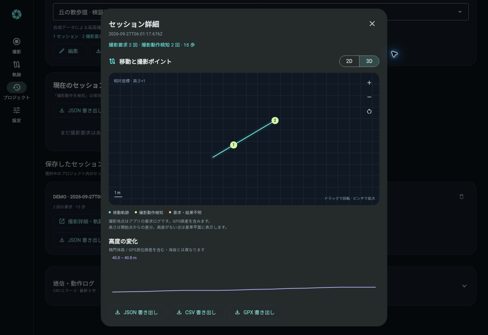

# 検証記録

## 2026-09-27 ブラウザー操作と修正

公開URL https://hossie-jp.github.io/osmo360-shutter-app/ をクラウドChromeで実際に操作しました。カメラ・実位置情報は使用せず、アプリのデモ位置を使用しています。

| 項目 | 確認結果 |
|---|---|
| 初期表示 | Material 3のダークUIと日本語が表示される |
| プロジェクト作成・編集 | 名前・説明を入力して保存、名前変更が反映される |
| デモ自動撮影 | 5歩→静止で1回、追加10歩→静止で1回。静止し続けても連写しない |
| セッション保存 | 15歩・撮影要求2件がプロジェクトに保存される |
| 2D/3D | 切替、3Dドラッグ回転、拡大／縮小が機能する |
| 撮影詳細 | 要求時刻、UTC、操作種別、GPS座標・水平／垂直精度・楕円体高を表示 |
| 再読み込み | 編集後のプロジェクト名と保存セッション・撮影2件が残る |
| 削除確認 | 対象プロジェクトと削除範囲を表示。キャンセル後も履歴を保持 |

### この検証で修正した内容

- プロジェクト／地図キー入力のコントローラーをダイアログ自身で管理し、閉じるアニメーション中の「破棄済みコントローラー」エラーを解消。
- プロジェクト名の空欄エラーを明示し、キーボード表示中も入力欄をスクロール可能にした。
- GPS送信の表示を、デモ・停止・一時停止・測位待ち・送信実績に応じて切り替える。
- 送信キューで待機中に一時停止したGPSパケットも、端末への送信直前に中止する。
- 幅360pxで撮影パネル見出しがはみ出す問題を修正。狭い画面では接続操作を縦配置。
- セッション詳細の閉じるボタン、設定スライダーの読み上げ情報を追加。
- 検証済みの依存バージョンをpubspec.lockへ固定し、ソースをDart標準形式で整形。

## 自動検証

Flutter 3.35.5 / Ubuntu 24.04、アプリ修正コミット `7e65e44e8018dfd5e2b349ffc763187d8ce55594`。

| 検証 | 結果 |
|---|---|
| Flutter静的解析 | 問題なし |
| Flutterテスト | 27件成功 |
| Webブリッジ／Service WorkerのNodeテスト | 11件成功 |
| Flutter Web release・Pages公開 | 成功 |
| Android debug APK生成 | 成功 |
| 公開HTTPSのHTML・manifest・アイコン・JS・地図HTML取得 | 成功 |

- [Web検証・公開ログ](https://github.com/HOSSIE-JP/osmo360-shutter-app/actions/runs/36299727432)
- [Android APKビルド](https://github.com/HOSSIE-JP/osmo360-shutter-app/actions/runs/36299727422)

360×640（下部キーボード300px）、390×844、1366×900の画面をウィジェットテストで確認。スマートフォン相当サイズの検査と、実端末での操作確認は区別しています。

## 実機確認として残る項目

- 実カメラとのBLE承認、撮影と画像保存、GPSのEXIF埋め込み。
- 端末の歩数／静止検出、位置情報・高度の品質、長時間の電池・温度。
- 有効なGoogle Maps APIキーを使った地図表示とAndroid WebViewのリファラー制限。
- PWAの実端末インストール、オフライン起動、更新の適用。
- ファイル書き出しの実端末での受領。今回のブラウザーではJSON/CSV操作後のダウンロード完了を取得できず、生成内容・APIキー除外は自動テストで確認した。インストール操作もOS側の完了確認は行っていない。

クラウドChromeではWebGLが使えずCPU描画で確認しました。アプリの実行エラーは確認していません。テストデータとデモ画面は実カメラの成功を示す証拠ではありません。

実機の確認手順は [HARDWARE_TESTS.md](HARDWARE_TESTS.md) にまとめています。
